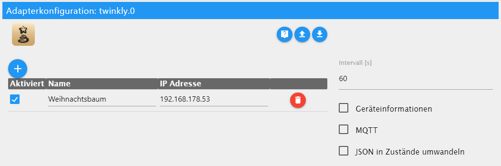

# ioBroker.twinkly

**Tests:** Linux/Mac: 
Windows: 

## twinkly adapter for ioBroker

Adapter to communicate with the [Twinkly lights](https://www.twinkly.com/).

**This adapter uses Sentry libraries to automatically report exceptions and code errors to the developers.** For more details and for information how to disable the error reporting see [Sentry-Plugin Documentation](https://github.com/ioBroker/plugin-sentry#plugin-sentry)! Sentry reporting is used starting with js-controller 3.0.

## Settings
The following Settings are available:

In the table you can add all the Twinkly lights you want to control. 

| Column       | Description                                                    |
|--------------|----------------------------------------------------------------|
| `Enabled`    | Shall this connection be accessed                              |
| `Name`       | Name of the connection in ioBroker                             |
| `IP Address` | IP-Address to the Twinkly Lights                               |
| `State On`   | Which `ledMode` should be activated when state `on` is enabled |

The following additionals States are created per device when checked:
* Device Info
* Network Status
* MQTT

The following States are available:

| State         | Writable           | Description                                                                                                                     |
|---------------|--------------------|---------------------------------------------------------------------------------------------------------------------------------|
| `connected`   | :x:                | Device Connected                                                                                                                |
| `details`     | :x:                | Device Details                                                                                                                  |
| `firmware`    | :x:                | Firmware Version                                                                                                                |
| `ledBri`      | :heavy_check_mark: | Brightness (deactivate control with -1)                                                                                         |
| `ledColor`    | :heavy_check_mark: | Color of LEDs, HSV/RGB(W)/HEX (`Color`)                                                                                         |
| `ledConfig`   | :heavy_check_mark: | Configuration of LEDs                                                                                                           |
| `ledEffect`   | :heavy_check_mark: | Effects (`Effect`)                                                                                                              |
| `ledLayout`   | :heavy_check_mark: | Layout of LEDs (disabled for further testing)                                                                                   |
| `ledMode`     | :heavy_check_mark: | Mode: Movie, Color, Effect, Playlist, Off, RealTime (not yet supported), Demo                                                   |
| `ledMovie`    | :heavy_check_mark: | Active Movie, If multiple Movies are added in the Playlist feature then they can be selected here. (`Movie`)                    |
| `ledPlaylist` | :heavy_check_mark: | Active Playlist Entry, Switch between Movies. (`Playlist`)                                                                      |
| `ledSat`      | :heavy_check_mark: | Saturation 0-100 (deactivate control with -1)                                                                                   |
| `mqtt`        | :heavy_check_mark: | MQTT-Connection                                                                                                                 |
| `name`        | :heavy_check_mark: | Name                                                                                                                            |
| `network`     | :x:                | Network-Information                                                                                                             |
| `on`          | :heavy_check_mark: | On/Off Switch                                                                                                                   |
| `paused`      | :heavy_check_mark: | Pause Connection to Twinkly so you can do changes in the App. Otherwise you might loose the connection while working in the App |
| `timer`       | :heavy_check_mark: | Update the Timer                                                                                                                |

[Private API information](https://xled-docs.readthedocs.io/en/latest/) by [Pavol Babinčák](https://github.com/scrool)

## Known Issues
* The maximum length for the movie name is 15 characters

## Changelog

<!--
  Placeholder for the next version (at the beginning of the line):
  ### **WORK IN PROGRESS**
-->
### 0.2.13 (2022-07-01)
* (patrickbs96) Update dependencies

### 0.2.11 (2022-01-02)
* (patrickbs96) Add setting to select which ledMode should be activated

### 0.2.10 (2021-12-31)
* (patrickbs96) Add setting to enable automatically switching of Mode after State change (color, effect, movie, playlist)

### 0.2.8 (2021-12-20)
* (patrickbs96) Rename mode On to movie as it's a better representation

### 0.2.7 (2021-12-19)
* (patrickbs96) Hex without Hash. Option to not use ping for reachability.

## License
MIT License

Copyright (c) 2022 patrickbs96 <patrickbsimon96@gmail.com>

Permission is hereby granted, free of charge, to any person obtaining a copy
of this software and associated documentation files (the "Software"), to deal
in the Software without restriction, including without limitation the rights
to use, copy, modify, merge, publish, distribute, sublicense, and/or sell
copies of the Software, and to permit persons to whom the Software is
furnished to do so, subject to the following conditions:

The above copyright notice and this permission notice shall be included in all
copies or substantial portions of the Software.

THE SOFTWARE IS PROVIDED "AS IS", WITHOUT WARRANTY OF ANY KIND, EXPRESS OR
IMPLIED, INCLUDING BUT NOT LIMITED TO THE WARRANTIES OF MERCHANTABILITY,
FITNESS FOR A PARTICULAR PURPOSE AND NONINFRINGEMENT. IN NO EVENT SHALL THE
AUTHORS OR COPYRIGHT HOLDERS BE LIABLE FOR ANY CLAIM, DAMAGES OR OTHER
LIABILITY, WHETHER IN AN ACTION OF CONTRACT, TORT OR OTHERWISE, ARISING FROM,
OUT OF OR IN CONNECTION WITH THE SOFTWARE OR THE USE OR OTHER DEALINGS IN THE
SOFTWARE.
